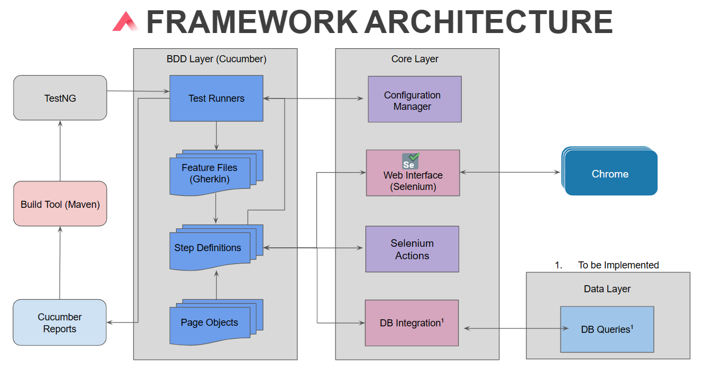

# Ontop Automation Exercise

Welcome to the Ontop Automation Exercise, a Java-based automation framework using Selenium, TestNG, Cucumber, Java Logging, and Cucumber Reports. This framework was designed around scalability, robustness and to test the Amazon web page.

## Table of Contents

- [Project Structure](#Project-Structure)
- [Features](#Features)
- [Prerequisites](#prerequisites)
- [Getting Started](#getting-started)
- [Test Execution](#Test-Execution)

## Project Structure

- **src/test/java/com/config**: This directory contains the config files used for the different environments.

- **src/test/java/com/feature**: Feature files containing the test steps for our test cases.

- **src/test/java/com/pomFiles**: All Page Objects files will be places in here.

- **src/test/java/com/stepDefs**: All Step Definition files will be places in here.

- **ConfigurationManager**: The configuration manager will be in charge of providing the information of staging.properties.

- **RunCucumberTest**: TestRunner file used to orchestrate the test execution

- **SeleniumActions**: Action file containing essential test actions



## Features

- TestNG for test execution and reporting.
- Cucumber for writing and managing feature files.
- Selenium for browser automation.
- Page Object Model (POM) for a more maintainable test code.
- Predefined hooks for setup and teardown.
- Simple, yet powerful, Java Logger.
- Parallel execution support.
- Test reports for tracking test results.

## Prerequisites

Before you get started, ensure you have the following tools and dependencies installed:

- Java Development Kit (JDK) 11.x.x
- Maven 3.9.x
- Chrome
- Windows

## Getting Started
1. Clone the repository:
   ```bash
   git clone https://github.com/AlfonsoEMora/Ontop_AutomationExercise.git>
   
2. Go to https://reports.cucumber.io/ and set up your env variable as:
   ```bash
   setx /M CUCUMBER_PUBLISH_TOKEN "some-secret-token"

3. Update the config files if needed

## Test Execution
1. Execute a mvn
   ```bash
   mvn test
   
2. Usually, reports are going to be stored in the Cucumber Reports repository. You can find those in [Cucumber IO](https://reports.cucumber.io/report-collections/f460a5f7-4feb-471f-91d2-ef3208d82010)
   